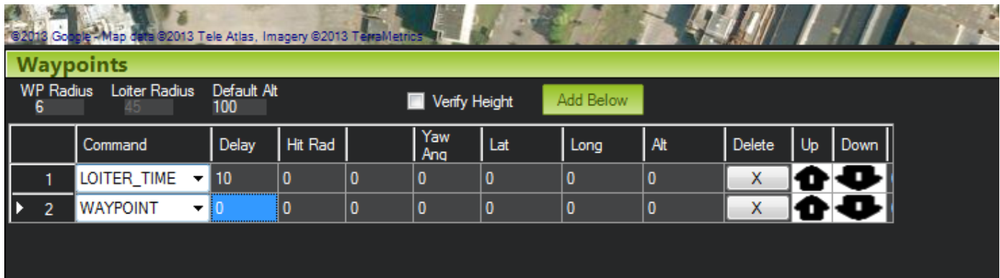

本文翻译自Shyam Balasubramanian所写的**MavLink Tutorial for Absolute Dummies (Part –I) , 2013**。仅供学习与交流。

# MAVLink绝对傻瓜教程（Part –I）

__MavLink__是什么鬼？它是一种通信协议。当看到这个概念后，大伙就开始畏惧它。这个教程将迫使你深刻地领悟它，并通俗易懂地阐述它究竟是什么，它是如何工作的，最重要的是它到底是如何工作的！！我将试着解释Mission Planner如何与APM/ PX4通信，反之亦然。这将有助于你的扩展，并激发你潜在的天才程序员天赋，如果你还没激发的话！！

PS. Mission Planner是一款开源的无人机地面站软件，APM/ PX4则分别为两种飞控固件（类似于windows和linux的关系）。而pixhawk是飞控硬件，它可以安装上述两种固件中的任何一个。

本教程假定：

1. 你是个小白☹我曾经也是，但现在不再是了!
2. 你至少在C语言方面具备一定的编程技能（例如，在C/C++/C#/Java中编写过简单的switch cases）。如果你已经是专业级，那么return 0;
3. 你很严肃地打算去学习知识，因为你将为此失去一些睡眠！

但不管怎样，请始终保持学习的意愿，我衷心希望你永远不会忘记这一点🙂我可以开始了吗？

## 我为你而来，MavLink

Mavlink消息基本上是由Mission Planner（MP）编码，并通过USB串行或遥测__发送到APM__的一个字节流（两者不能同时使用。如果同时插入，则优先选择USB，而忽略遥测）。这里的__编码__并没有什么特别之处，只是把数据包放入一个数据结构中，然后通过信道以字节的形式发送出去，同时加上一些错误纠正。

## MavLink消息的结构：

每个MavLink数据包的长度为17字节，结构如下：

```
消息长度 = 17 (6 bytes header + 9 bytes payload + 2 bytes checksum)
```

```
长度为6个字节的首部 header
0. message header, 永远为 0xFE
1. message length (9)
2. sequence number -- 在 255 和 0 之间轮转(0x4e，前一个是 0x4d)
3. System ID - 什么系统在发送这个消息 (1)
4. Component ID- 系统的哪个组件正在发送消息 (1)
5. Message ID (例如 0 = heartbeat 等等! 别害羞，你也可以添加..)

可变长的有效负载 Payload (由八位组构成, 范围是 0..255)
** Payload (我们感兴趣的实际数据)

校验和 Checksum: 用于错误检测
```

PS. “由八位组构成”在原文中是specified in octet 1

（APM）软件所做的事情是，检查它是否为一个有效的消息（通过检查Checksum判断消息是否已损坏，丢弃已经损坏的消息）。这是遥测的波特率为什么设置为57,600而不是115,200 bps的原因之一。该数值越低，软件容易发生的错误就越少，虽然消息更新到地面站的速度会慢一些。如果你想在采用MavLink协议的同时取得更远点的距离，进一步降低波特率可能是一个好主意。然而，需要注意的是，经过测试，57,600bps在理论上可以通过3DR遥测无线电提供大约一英里半径的覆盖范围。还记得高中时的信噪比（SNIR）的概念吗?

现在，根据上面的内容，我们感兴趣的东西是：

* System ID（亦称消息的来源）：这是指通过无线遥测或USB端口向APM发送消息的发送源（也就是MP），软件会定期进行检查，以确认消息是发送给它的。
* Component ID （亦称系统中的子系统）：主系统中的任何子系统。目前，这里并没有子系统，我们也没有真正利用这个字段。
* Message ID：标识这是条关于什么的信息。在本教程中，我们将其称为“主消息（main message）”。
* Payload（实际数据）：这就是肉！这就是你想要的！！

## MavLink到底是如何工作的 

MavLink啥也不是就是一条消息。MavLink也可以用于地面机器人，所以微型飞行器链路（Micro Aerial Vehicle Link，也就是MavLink） 并不是一个十分贴切的名字。之所以采取这种方式命名呢，是因为它起始于直升机（如果我没猜错的话）。

“消息”是一个包含“常量字节数”（如前所述，即17字节）的数据包。APM（从空中）获取流字节，将其传输到硬件接口（例如，通过UART或遥测），并在软件中对消息进行解码。注意，<u>__消息__包含着我们即将提取的有效负载（payload）</u>。

我们对__有效负载__很感兴趣，但是，嘿，和有效负载在一起的是__Message ID__（见上面），<u>我们可以通过它了解__有效负载__代表着什么</u>。在这之前，先看看程序解释一切MavLink消息的几个步骤：

1. 我们有一个名为handlemessage (msg)的方法。这个就是你需要学习和了解的方法！在GCS_MavLink.pde中找到它（在Arducopter/ ArduPlane里）。

   PS. 该方法隶属APM固件的源代码。GCS_MavLink.pde现在似乎是这个https://github.com/ArduPilot/ardupilot/blob/8f550ffdd48a3165c115ca24d6ce5227a5f826d1/ArduCopter/GCS_Mavlink.cpp

   它基本上是在问信息包：嘿，你是谁？你是为我而来还是试图侵入我的系统？在我给予你许可之前，让我先读一下你的__系统ID和组件ID__。<u>任何使用MavLink的系统都有一个系统ID和组件ID</u>。例如，你的MP和正在飞行的四轴飞行器将具有相同的系统ID。组件ID则用于附加到APM/PX4的“子系统”。

   注意：当前，系统ID和组件ID被__<u>硬编码</u>__为相同的。

   现在，你仅有一个遥测和一架安装了APM的直升机，就是这样，去愉快地飞行吧-不用再考虑其它的！这些东西对多直升机有帮助（在未来），未来将会有不同的系统ID🙂

2. 我们从消息中提取有效负载并放入一个__包（packet）__中。包是基于一种“信息类型”的数据结构。我们将不再使用“消息”一词，那玩意儿到这里就结束了。我们基本上只对由“原始数据”打包而成的包感兴趣。

3. 包被放入一个“适当的数据结构”中。有许多数据结构 ，例如用来存放姿态（俯仰，横摇，偏航方向）的、GPS的、无线电控制信道的，等等，也就是，把相似的东西组合在一起，形成易于理解的模块。这些数据结构在发送端和接收端（即在MP端和APM端）__“100%完全相同”__。 如果不一样的话，你的直升机就会在奇怪的时间坠毁！

PS. 无线电控制信道原文中为RC channel

此外，这也是MavLink GUI生成器大展身手的地方。为了生成这些数据结构，我们不需要编写任何代码！！嗯，也不完全是，但只有一点点。

到目前为止很简单对不对？如果觉得困难请重读一遍！！当个笨蛋没关系的🙂

好了，现在说正事。我们使用MavLink发送双向消息。

> 从地面控制站（GCS）到APM/PX4或从APM/PX4到地面控制站（GCS）。注意，我说的GCS是指Mission Planner（MP）或者QGroundControl（QGC）、DroidPlanner（DP）或者你自定义的与直升机通信的工具。

## 地面控制站（GCS）到四轴飞行器：

到目前为止，我们知道每个消息（我们叫一个包，里面有对我们有用的信息）都有一个消息ID和有效负载，并将其放入适当类型的数据结构中。我们根据主消息（或MAVLINK_MSG_ID_）进行选择，一旦检测到特定类型的消息，就会执行一些神奇的操作，比如将接收到的信息存储到永久内存中，或者执行我们希望对其执行的任何操作。

截至2013年11月，在Arducopter最新的3.0.1 RC5（候选版本）中，以下是你可能看到的参数。我已经试着列出所有可能的MavLink消息的“主消息”ID。

请注意，在每个“主消息”类别中（如粗体部分下面的东西）你会找到属于那个类别的“子消息”，它们基本上与有效负载信息（真正的肉）及其处理方式密切相关。就像“自行车”类别有雅马哈，铃木，哈雷戴维森等。我列出了所有的主要信息类别，但只指定了一些子类别。你可以自己查一下细节🙂因为如果你明白我到目前为止的意思，你就不再是个傻瓜了。明白我的意思吗？

PS. 因为下面的部分，准确含义并不太清楚，所以只选了若干个翻译。详情看原文：https://diydrones.com/forum/topics/mavlink-tutorial-for-absolute-dummies-part-i?groupUrl=arducopterusergroup

__MAVLINK_MSG_ID__（主消息块）：

1. MAVLINK_MSG_ID_HEARTBEAT：//0

   这是__最重要的信息__。GCS不断地向APM/PX4发送信息，以确定它是否与之相连（每1秒一次）。这是为了确保在更新某些参数时MP与APM是同步的。如果错过了许多心跳信号，则会触发故障保护（可能），接着直升机可能着陆、继续执行任务或返回发射（Returns to launch，也称为RTL）。在MP的“配置/设置故障保护选项”下，可以启用/禁用故障保护选项。但你不能停止心跳，对吗？这个名字很有道理！!

2. MAVLINK_MSG_ID_REQUEST_DATA_STREAM：//66

   请求传感器，无线电控制信道，GPS位置，状态，Extra 1/2/3 等数据

3. MAVLINK_MSG_ID_COMMAND_LONG：//76 

   无限制悬停（Loiter unlimited），RTL，着陆，任务开始（Mission start），飞控解锁/锁定（Arm/Disarm ），重新启动（Reboot）。

   PS. 例如在航前检查未通过时是禁止直接用commander arm对飞控解锁的。

4. SET_MODE： //11 

   E.g. set_mode(packet.custom_mode); 

5. MAVLINK_MSG_ID_MISSION_REQUEST_LIST： //43 

6. MAVLINK_MSG_ID_MISSION_REQUEST： //40 

7. MAVLINK_MSG_ID_MISSION_ACK： //47 

8. MAVLINK_MSG_ID_PARAM_REQUEST_LIST： //21 

9. MAVLINK_MSG_ID_PARAM_REQUEST_READ： //20 

10. MAVLINK_MSG_ID_MISSION_CLEAR_ALL： //45 

11. MAVLINK_MSG_ID_MISSION_SET_CURRENT： //41 

12. MAVLINK_MSG_ID_MISSION_COUNT： // 44 

13. MAVLINK_MSG_ID_MISSION_WRITE_PARTIAL_LIST： // 

14. MAVLINK_MSG_ID_SET_MAG_OFFSETS： //151 

15. MAVLINK_MSG_ID_MISSION_ITEM： //39 

   > PS. 看不懂，这部分翻译得宛如狗屎。不翻了。
   >
   >  （1）这部分很有趣！此消息包含用于执行实时操作的子消息，比如设置航点以及高级功能等。其工作原理如下：从GCS接收一个航点（WP），并将其存储在APM/PX4的EEPROM中
   >
   > （2）发送4个参数（例如延迟、HitRad和偏航角）作为LOITER_TIME （视为ID）+ （Lat，Long，Alt：定义了物体在空间中的3D位置）。这些参数在code + Options（1 = 存储高度（Alt）相对于初始高度）中定义为Enum。每个命令（或ID）可能有不同的参数。MP显示“空白”列标题，因为没有为这个ID定义参数。
   >
   > 总结一下，每个动作都会发送以下有趣的参数:
   >
   > 4个参数 + ID（动作）+（Lat，Long，Alt）定义了直升机的3D位置。注意，4参数可以是一些自定义的动作，如相机设置，相机触发，悬浮时间等。   
   >
   > （3）如下图所示，每个ID定义一个航路点（AFAIK）。LOITER_TIME，LOITER_UNLIMITED，WAYPOINT都是随其他参数（纬度、经度和高度）一起发送的航路点，因为每个参数都保存为APM/PX4中的一个航路点。期间
   >
   > （4）请记住：在当前的设计中，高度总相对于home高度而言的（总是！）
   >
   > （5）您可以在Common.xml中定义“这些操作”，并使用Python GUI生成器生成APM/PX4将使用的代码。让我稍后谈到这一点，或者在论坛中问我如何做。我提到过，您可以为（4 params）添加自己感兴趣的参数。     
   >
   > （6）当APM收到这个'main'命令时（MAVLINK_MSG_ID_MISSION_ITEM ），它从MavLink包中读取ID，并对ID执行switch(case)操作。
   >
   > （7）Loiter turns、设定home、悬浮时间、重复servo、设定servo等。

16. MAVLINK_MSG_ID_PARAM_SET： //23 

17. MAVLINK_MSG_ID_RC_CHANNELS_OVERRIDE： //70 

18. MAVLINK_MSG_ID_HIL_STATE： //90 

19. MAVLINK_MSG_ID_DIGICAM_CONFIGURE： // 

20. MAVLINK_MSG_ID_MOUNT_CONFIGURE： // 

21. MAVLINK_MSG_ID_MOUNT_CONTROL： // 

22. MAVLINK_MSG_ID_MOUNT_STATUS：// 

23. MAVLINK_MSG_ID_RADIO, MAVLINK_MSG_ID_RADIO_STATUS： // 

## 四轴飞行器到地面控制站（GCS）到四轴飞行器：

好吧，我承认，这变得更有趣了。但这其实容易得多。事实上，GCS系统只是你和直升机之间的中介物，它反过来从直升机获取数据，并显示在GCS系统上。

如果你打开了Arducopter.pde文件，请查看代码的这一部分：

PS. Arducopter.pde现在似乎是这个https://github.com/ArduPilot/ardupilot/blob/master/ArduCopter/Copter.cpp

```c
static const AP_Scheduler::Task scheduler_tasks[] PROGMEM = {
. . .
. . .
{ gcs_send_heartbeat, 100, 150 },
{ update_notify, 2, 100 },
{ one_hz_loop, 100, 420 },
{ gcs_check_input, 2, 550 },
{ gcs_send_heartbeat, 100, 150 },
{ gcs_send_deferred, 2, 720 },
{ gcs_data_stream_send, 2, 950 },
. . .
. . .
. . .
```

别害怕。这比呼吸还容易。这就是__实时系统__概念发挥作用的地方。我们希望确定的任务花费确定的时间，如果到了规定的时间任务仍没完成，就不再继续执行它们了。

第一个参数是函数名，

第二个是“它应该花费的时间”（以10毫秒为单位，例如2表示20毫秒执行一次，即50赫兹，即该功能每秒运行50次）。

PS. 1s = 1000ms 故 1000 / 20 = 50 ms/次 = 50Hz

第三个参数是“最长执行时间，超出该时间函数就不应继续运行”。

我觉得这很简单！你在这里看到的每一个函数，它的未来都是确定的，运行时间都是一成不变的。这就是为什么我们在这些讨厌的机器上采用实时系统，这可以保证它的安全，让其变得可预测而不是不可预测！！

所有这些函数都是为你精心挑选的，以便让你知道它们与GCS系统的更新相关。简单地说，进入每一个函数的定义，这些函数将始终可以在GCS_Mavlink.pde中找到，在那里GCS系统通信的实际操作发生了！!

最有趣（也是最重要）的是：

```c
/*
* send data streams in the given rate range on both links
*/
static void gcs_data_stream_send(void)
{
	gcs0.data_stream_send();
	if (gcs3.initialised) {
		gcs3.data_stream_send();
	}
}
```

上面所做的事情是，通过链路发送数据（gcs0表示通过USB，gcs3表示通过遥测）。如果你再深入一点，你就会知道，我们会把这些数据结构发送回GCS系统显示。

例如，当你用手移动你的直升机时，瞧瞧MP的HUD屏幕发生了什么？你将看到直升机在屏幕上移动。并且，我们得到了每个时间单位的飞行姿态数据（俯仰、横摇和偏航）。同样，我们还可以看到IMU数据、GPS数据、电池数据等。