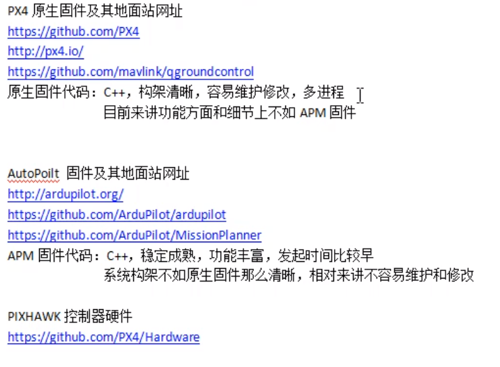

# 无人机地面站开发

[TOC]

## 一、基础知识




PX4是一个固件，核心操作系统是NuttX实时ARM系统，ARM是一款RISC微处理器 ，RISC是精简指令集计算机。
GCS=Ground Control Station
UAV=Unmanned Aerial Vehicle

.NET的核心技术是.NET Framework
.NET Framework=CLR（相当于JVM）+基类库(相当于JDK)
.NET Core主要是跨平台
.NET Framework主要是运行于Windows
C#编写的是托管程序，必须有.NET framework才可运行，而c和c++则不要。

USB是一种高速的串口通讯协议
串行接口=串口Serial Interface
注意port和Interface是同义词
serial port
an interface 
(commonly used for modems and mice and some printers) 
that transmits data a bit 
at a time

无线通信：电磁波信号可以在自由空间中传播
有线通信：利用金属导线、光纤等有形媒质传送信息

有线通信可以转化为无线通信，方法是用某个中继系统。

现在我们已经可以通过USB方式与PX4设备建立物理连接


## 二、如何与飞控进行通信

__01 成功打开并运行simple_example__

__02 宏观上梳理simple_example做了啥（确保物理连接、串口通信、接收消息、发消息）__

__03 补充知识：__总的来说，飞控连接电脑是一种USB-to-COM虚拟串口。BaudRate波特率，也就是串口通讯的速度，进行串口通讯的双方其波特率需要相同，如果用PC连接其他非PC系统，一般地，波特率由非PC系统决定。波特率表示每秒钟传送的码元符号的个数，是衡量“数据传送速率”的指标，它用单位时间内载波调制状态改变的次数来表示。单片机或计算机在串口通信时的速率。单位“波特”本身就已经是代表每秒的调制数，以“波特每秒”（Baud per second）为单位是一种常见的错误。波特率与比特率的关系也可换算成：比特率=波特率*单个调制状态对应的二进制位数。例如假设数据传送速率为120符号/秒(symbol/s)(也就是波特率为120Baud)，又假设每一个符号为八相调制(单个调制状态对应3个二进制位)，则其传送的比特率为(120symbol/s) * (3bit/symbol)=360bps

意思是__一个symbol的可能状态数要用3位二进制数字表达__（注：1字节byte=8bit比特、位），只有同时知道波特率和一个symbol的bit数才能知道比特率，即运输速度。

顺便一提：serialPort1.DataBits的默认值是8也就是1个字节，8bit/symbol

现在的问题是BaudRate是由谁来定的？是可以自定义还是由飞控决定？暂且搁置


__04.1 仿制一款简单的串口通信工具__

【a】

打开串口.

【b】

listBox如何添加消息 如何不可選中 如何總是滾動到最下面

窗口如何固定大小，不可resize

listBox1.ItemHeight在构造器里值为18 和 初始值一致

但在方法中变为 12 不懂原因在哪 所以 暂时 进行实时计算

【c】

一旦连接成功，飞控开始源源不断向PC返回数据

BytesToRead和ReadBufferSize不关心后者

飞控大体遵循以17个字节/每秒返回数据

看看这17个字节里面有啥 


__04.2 MAVLink协议入门__（Micro Air Vehicle Link）

对一个具体的17个字节进行分析

将listBox里的内容复制出来

【254-9-136-1-1-0】 【 -0-0-0-0-2-3-81-3-3-】【197-56】

前6个字节

254标识一个消息包的开始，恒为254（PS. (十六进制) = 254(十进制)=11111110(二进制)）

9标识消息里的负载内容的长度，这里说明负载长度为9

136序列码，每发一个消息包加序列码的值1，可用来计算丢包率

1标识发消息的系统

1标识发消息的组件

0表示消息种类---这里是心跳包的意思

第7到第15（7+9-1）位是数据，依赖于消息ID

第16和17位是校验码Check-sum of the entire packet, excluding the packet start sign (LSB to MSB)

根据官方文档#0解析【 -0-0-0-0-2-3-81-3-3-】含义

0 MAV TPYE 交通工具或部件类型 --- Generic micro air vehicle

0 autopilot 飞控类型 --- Generic autopilot, full support for everything

0 base_mode 飞行模式，需要自定义？含义不明

0-2-3-81 custom mode 飞控现在所处的飞行模式，这个参数要看各个飞控自己的定义方式，会有不同的组合、计算方式。A bitfield for use for autopilot-specific flags

3 system_status --- 该值没对应的？？查源代码枚举变量注释也没有，只有0是对应Uninitialized system, state is unknown.

3 mavlink_version 协议版本

补充知识：

1字节     uint8_t
2字节     uint16_t
4字节     uint32_t
8字节     uint64_t


__04.3 心跳协议__

https://mavlink.io/en/services/heartbeat.html

组件必须定期广播`HEARTBEAT`并监视来自其他组件/系统的心跳

简而言之，对于其它组件而言，有心跳说明还连接着那个组件，没心跳则说明已经断开了。正常的心跳（广播）速率应该是1Hz（每秒一次）

其次，还可用通过心跳判断载具类型、飞行状态，以此来决定地面站GUI的布局、表现方法。


__04.4 获取心跳之外的消息__

如果什么都不做的话，飞控将源源不断地发送“心跳”消息，现在我们需要获取“心跳”以外的消息，势必就需要发送一些消息到飞控，告知它发送其它的一些消息。

我们想得到什么消息：最关键的是，飞控的1高度、2gps定位，3以及飞行状态

最直接、简单的方法就是查看simple_example源代码，其次为通读mavlink文档，几个问题：

1-异步和System.Threading.Thread.Sleep的必要性

2-线程间操作无效 从不是创建控件XXX 的线程访问它。就是没法在其它线程更新GUI了。

3-c#中的try catch语句 

4-c#中的lock语句 


__05 串口调试__

其实就只有两件事情，接消息和发消息。

采用串口调试工具sscom5调试最开始显示乱码，然后用hex（十六进制）显示就好了。

[12:09:31.841]收←◆FE 09 B2 01 01 00 00 00 00 00 02 03 51 03 03 1A 59 
[12:09:32.098]收←◆FE 10 B3 01 01 6F 00 00 00 00 00 00 00 00 D1 3B 38 82 79 01 00 00 19 86 
[12:09:32.842]收←◆FE 09 B4 01 01 00 00 00 00 00 02 03 51 03 03 77 57 
[12:09:33.841]收←◆FE 09 B5 01 01 00 00 00 00 00 02 03 51 03 03 9D 29 
[12:09:34.841]收←◆FE 09 B6 01 01 00 00 00 00 00 02 03 51 03 03 A3 AA 
[12:09:35.842]收←◆FE 09 B7 01 01 00 00 00 00 00 02 03 51 03 03 49 D4 
[12:09:36.841]收←◆FE 09 B8 01 01 00 00 00 00 00 02 03 51 03 03 AD 4B 
[12:09:37.841]收←◆FE 09 B9 01 01 00 00 00 00 00 02 03 51 03 03 47 35 
[12:09:38.840]收←◆FE 09 BA 01 01 00 00 00 00 00 02 03 51 03 03 79 B6 
[12:09:39.840]收←◆FE 09 BB 01 01 00 00 00 00 00 02 03 51 03 03 93 C8 
[12:09:40.840]收←◆FE 09 BC 01 01 00 00 00 00 00 02 03 51 03 03 14 B8 
[12:09:41.840]收←◆FE 09 BD 01 01 00 00 00 00 00 02 03 51 03 03 FE C6 

> 根据mavlink2016解释：
>
> 00心跳包，有效负载长9字节，内容为00 00 00 【00 02 03 51】 03 03
>
> 意思是为【通用微型飞行器】【通用自动驾驶仪，全面支持一切】，CRC是FE C6 

[12:09:42.097]收←◆FE 10 BE 01 01 6F 00 00 00 00 00 00 00 00 B1 F3 67 D6 7B 01 00 00 3F 60 

> 根据mavlink2016解释：
>
> 6F时间同步消息，有效负载长16字节，内容为【00 00 00 00 00 00 00 00】【B1 F3 67 D6 7B 01 00 00】
>
> 意思不明应该是时间，CRC是3F 60 

根据simple_example以及mavlink2016编辑一条请求数据的REQUEST_DATA_STREAM的消息。

```C#
                    // request streams at 2 hz
                    var buffer = mavlink.GenerateMAVLinkPacket10(MAVLink.MAVLINK_MSG_ID.REQUEST_DATA_STREAM,
                        new MAVLink.mavlink_request_data_stream_t()
                        {
                            req_message_rate = 2,
                            req_stream_id = (byte)MAVLink.MAV_DATA_STREAM.ALL,
                            start_stop = 1,
                            target_component = compid,
                            target_system = sysid
                        });
```
翻译成字节流如下。

首部：FE 06 00 01 01 42

有效负载：01 01 00 00 02 01（01 01直接复制前面就可，00是请求所有数据，00 02是请求速率2hz，最后一字节01表示开始，而00则表示结束）

两个字节的CRC由网上的工具自动生成（X.25 CRC），注意FE不参与计算

示例：FE 06 00 01 01 42 01 01 00 00 02 01

结果是毫无反应，还是得用统一的mavlink包计算CRC才行。

有一个办法是输出simple_example封装好的包再拿到调试工具里面尝试。

```c#
                    // 调试用输出16进制
                    foreach (byte b in buffer)
                    {
                        Console.Write(b.ToString("X2") + " ");
                    }

                    Console.WriteLine();
```
结果如下：

FE 06 10 FF BE 42 02 00 01 01 00 01 1F 5B
FE 06 12 FF BE 42 02 00 01 01 00 01 3D F0
FE 06 14 FF BE 42 02 00 01 01 00 01 4A 05
FE 06 16 FF BE 42 02 00 01 01 00 01 68 AE
FE 06 18 FF BE 42 02 00 01 01 00 01 B5 E7
FE 06 1A FF BE 42 02 00 01 01 00 01 97 4C

在串口调试工具中任意发送上面的一条信息，成功得到返回信息。而且在关闭串口重新打开后还是源源不断地收到数据。或许只有通过发送00或者断开物理连接才能结束。

截取某次收到的消息为（以下所有包是一次性收到的）

【FE 1C A7 01 01 1E】 【71 9F 00 00 D1 C3 8D BC 57 A3 89 BC 13 E3 CD 3F E0 CE A1 37 B5 2F D7 B8 56 64 F3 39】 97 37 

> 继续当前航向，爬升/下降到指定高度。当高度到达时，继续执行下一个命令(即，在到达目标高度之前不要执行下一个命令。

【FE 1C A8 01 01 21】 71 9F 00 00 00 00 00 00 00 00 00 00 F6 FF FF FF F0 FF FF FF 00 00 00 00 00 00 FF 23 31 68 

> 在发送了follow target命令后重新定位MAV

【FE 1F A9 01 01 01】 0F FC 60 03 0F 1C 60 00 0F 9C 70 01 EC 01 00 00 FF FF 00 00 00 00 00 00 00 00 00 00 00 00 FF 4B C9 

> 一般系统状态。如果系统是MAVLink标准后,系统状态主要是由三个正交状态/模式:定义系统模式,这要么是锁(汽车关闭和锁定),手动(RC控制系统),引导(与自动位置控制系统,位置定位点)手动控制或自动(系统遵循路径/路标规划)。NAV_MODE定义了当前飞行状态:起飞(通常是开环机动)、着陆、航路点或矢量。这表示内部导航状态机。系统状态显示系统当前是否处于活动状态，以及是否发生紧急情况。在关键和紧急状态时，MAV仍被认为是活动的，但应自主启动应急程序。故障发生后，它应该首先从活动到关键，以允许手动干预，然后移动到紧急后，一定的超时。

【FE 06 AA 01 01 7D】 2B 12 77 11 04 00 E7 12 

> 电源状态

【FE 04 AB 01 01 98】 00 00 FF FF A6 21 

> MAV_COMP_ID_SERVO13

【FE 1A AC 01 01 3E】 46 D5 C7 38 7D 74 CD B9 86 F0 32 BE 00 00 00 00 00 00 00 00 5C 00 00 00 00 00 94 64 

> 固定翼导航和位置控制器的状态。

【FE 02 AD 01 01 2A】 00 00 4D 3A 

> 通知当前活动任务项的序列号的消息。MAV将飞向这个任务项目。

【FE 14 AE 01 01 4A】 00 00 00 00 04 6A 7E 3A 0A D7 23 BC CC A8 2C BB 5C 00 00 00 35 BA 

> 数据通常显示在固定翼飞机的HUD上

【FE 15 AF 01 01 24】 AF DD 6E 02 4C 04 4C 04 4C 04 4C 04 00 00 00 00 00 00 00 00 00 A9 C4 

> 伺服输出的原始值(对于来自远程的RC输入，使用RC_CHANNELS消息)。标准的PPM调制如下:1000微秒:0%，2000微秒:100%。

【FE 2A B0 01 01 41】 74 9F 00 00 00 00 00 00 00 00 00 00 00 00 00 00 00 00 00 00 00 00 00 00 00 00 00 00 00 00 00 00 00 00 00 00 00 00 00 00 00 00 47 4A 

> 接收到的RC通道的PPM值。标准的PPM调制如下:1000微秒:0%，2000微秒:100%。个别接收器/发射器可能违反此规格。

【FE 16 B1 01 01 23】 74 9F 00 00 00 00 00 00 00 00 00 00 00 00 00 00 00 00 00 00 00 00 2A 81 

> 接收到的RC通道的原始值。标准的PPM调制如下:1000微秒:0%，2000微秒:100%。个别接收器/发射器可能违反此规格。

【FE 1A B2 01 01 1B】 4D DE 6E 02 00 00 00 00 F1 FF 01 00 2F FC 00 00 00 00 00 00 F0 FF F9 FD 94 00 3B A8 

> 通常9自由度传感器设置的原始IMU读数。此消息应该始终包含真实的原始值，而不进行任何缩放以允许数据捕获和系统调试。

**【FE 16 B3 01 01 74】【 76 9F 00 00 E5 FF 24 00 1A FC FE FF 02 00 04 00 00 00 00 00 00 00】 5E 24** 

【FE 0E B4 01 01 1D】 76 9F 00 00 46 AE 76 44 00 00 00 00 69 0E 3B 55 

【FE 1E B5 01 01 18】 00 00 00 00 00 00 00 00 00 00 00 00 00 00 00 00 00 00 00 00 FF FF FF FF 00 00 00 00 00 00 CD B4 

> 全球定位系统(GPS)返回的全球位置。这不是系统的全局位置估计，而是一个原始的传感器值。有关全局位置估计，请参见消息GLOBAL_POSITION。坐标系为右手坐标系，z轴向上(GPS坐标系)。

【FE 0C B6 01 01 02】 00 00 00 00 00 00 00 00 78 9F 00 00 89 DE 

> SYSTEM_TIME

【FE 1C B7 01 01 A3】 54 E6 84 39 EC E5 55 B9 F4 CE 81 B9 00 00 00 00 00 00 00 00 94 D4 D3 3B AD 1A 69 3B C7 EF 

【FE 18 B8 01 01 B2】 AE 9D A8 BC E1 E1 3B BC 2C F3 CD 3F 00 00 00 00 00 00 00 00 00 00 00 00 10 21 

【FE 28 B9 01 01 B6】 B4 BD 8D BC ED A2 89 BC 27 E3 CD 3F 00 00 00 00 00 00 00 00 00 00 00 00 00 00 00 00 00 00 00 00 00 00 00 00 00 00 00 00 AE 96 

【FE 03 BA 01 01 A5】 32 12 00 4D CD 

【FE 16 BB 01 01 C1】 00 00 00 00 35 A5 AB 39 86 5D 13 3C A3 A8 1B 3A 00 00 00 00 A5 00 5B 6A 

【FE 20 BC 01 01 F1】 F2 0D 6F 02 00 00 00 00 B1 D1 DA 3C BE 7F EC 3C 6E E1 16 3D 00 00 00 00 00 00 00 00 00 00 00 00 EC 75 


## 三、地面站开发日志

**06 参考simple_example代码、引用simple_example中的MAVLink.dll和log4net.dll改善程序，因为对于serialPort而言写操作是否线程安全不确定，而多线程读是必然需要加锁的，因此，将写操作单独放置于一个线程，而读操作则可以在加锁的情况下放在多个线程，这就是目前为止的设计，现在最关键的是c#GUI的程序的设计问题这方面还需要调研和学习**


控件的学习思路：干啥的？属性？触发哪些事件？

一种思路是地面站开发思路叫做，linkedEvent。另外一个是进行增量式的设计，除刚开始的请求数据，以及后续的心跳包外，只收不发。尽量把几个视图做好。完全参考simple_example里的可靠代码。


**VS如何push到Git，窗口右下角找到一个Git图标**

打开来找到push to remote repository，它会让你填一个URL，你在Git上建立好仓库

然后把URL拷贝到那里去，点下按钮即可。

然后commit仍然首先要在本地做，修改文件，然后点击changes查看改动

然后点commit all在本地提交commit

然后点sync在里面点push即可。


第一个类叫做GCS4MAVLink其实就是主窗口，它的组件是

两个combo_box外加一个连接按钮，仅引用MAVLink.ddl

**如何借助命令行调试窗体程序，**右键项目修改output type为console app

**死活读不出来（意思是一直卡在lock里面不断continue而读不到package）**，然后添加了log4net.ddl后突然有用，问题在于我之前没用log4net的程序也可以正常跑啊？？

两个不同点，第一，之前那个没有lock语句。第二，之前那个不是console application


